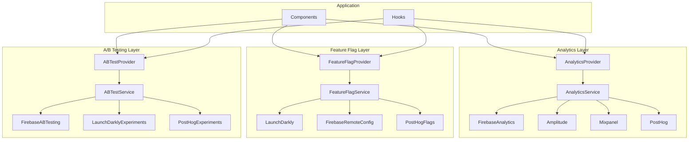

# Analytics & A/B Testing Entegrasyon Planı

## Genel Bakış

Bu plan, CineSearch uygulamasına kapsamlı analytics ve A/B testing entegrasyonunu içerir.

## Mimari



## Servisler

### 1. Analytics Servisleri

| Servis | Amaç | Özellikler |
|--------|------|------------|
| **Firebase Analytics** | Temel analytics, Google entegrasyonu | Otomatik event'ler, audience, conversion |
| **Amplitude** | Detaylı user journey, funnel analysis | Retention, cohort analysis, pathfinder |
| **Mixpanel** | Real-time analytics, segmentation | Live view, signals, impact analysis |
| **PostHog** | Product analytics, session replay | Feature flags + analytics birlikte |

### 2. Feature Flag Servisleri

| Servis | Amaç | Özellikler |
|--------|------|------------|
| **LaunchDarkly** | Enterprise feature flags | Targeting, scheduling, approvals |
| **Firebase Remote Config** | Basit feature flags | A/B test entegrasyonu, real-time |
| **PostHog** | Open-source flags | Self-host option, analytics entegrasyonu |

### 3. A/B Testing Servisleri

| Servis | Amaç | Özellikler |
|--------|------|------------|
| **Firebase A/B Testing** | Basit A/B testler | Remote Config ile entegre |
| **LaunchDarkly** | Gelişmiş experiment'ler | Multivariate, holdouts, guardrails |
| **PostHog** | Product-led A/B testing | Funnel-based, autocapture |

## Proje Yapısı

```
analytics/
├── core/
│   ├── analytics-service.ts      # Ana analytics servisi
│   ├── feature-flag-service.ts   # Feature flag servisi
│   └── ab-test-service.ts        # A/B test servisi
├── providers/
│   ├── analytics-provider.tsx    # React provider
│   ├── feature-flag-provider.tsx # Feature flag provider
│   └── ab-test-provider.tsx      # A/B test provider
├── adapters/
│   ├── firebase-adapter.ts       # Firebase Analytics
│   ├── amplitude-adapter.ts      # Amplitude
│   ├── mixpanel-adapter.ts       # Mixpanel
│   ├── posthog-adapter.ts        # PostHog
│   ├── launchdarkly-adapter.ts   # LaunchDarkly
│   └── firebase-config-adapter.ts # Firebase Remote Config
├── hooks/
│   ├── useAnalytics.ts           # Analytics hook
│   ├── useFeatureFlag.ts         # Feature flag hook
│   ├── useABTest.ts              # A/B test hook
│   └── useUserProperties.ts      # User properties hook
└── utils/
    ├── event-constants.ts        # Event isimleri
    ├── user-properties.ts        # User property tanımları
    └── analytics-utils.ts        # Yardımcı fonksiyonlar
```

## Entegrasyon Adımları

### Phase 1: Core Layer
1. Analytics abstraction layer
2. Feature flag abstraction layer
3. A/B test abstraction layer

### Phase 2: Provider Implementasyonları
1. Firebase Analytics
2. Firebase Remote Config
3. Firebase A/B Testing

### Phase 3: Third-party Entegrasyonları
1. Amplitude
2. Mixpanel
3. PostHog
4. LaunchDarkly

### Phase 4: React Entegrasyonu
1. Provider'lar
2. Hook'lar
3. Component wrapper'lar

## Event Kategorileri

### 1. Lifecycle Events
- app_open
- app_background
- app_foreground
- session_start
- session_end

### 2. Navigation Events
- screen_view
- tab_switch
- back_navigation

### 3. User Action Events
- button_press
- swipe
- scroll
- search
- filter_apply

### 4. Content Events
- movie_view
- movie_play
- movie_favorite
- movie_share
- trailer_watch

### 5. Auth Events
- login_start
- login_success
- login_failure
- logout
- biometric_auth

### 6. Feature Events
- feature_enabled (feature flag)
- experiment_enrolled (A/B test)
- experiment_conversion

## User Properties

### Demografik
- age
- gender
- location
- language

### Teknik
- app_version
- os_version
- device_model
- network_type

### Davranışsal
- favorite_genres
- watch_history
- search_history
- subscription_status

### Experiment
- experiment_variants
- feature_flag_assignments

## Feature Flag Örnekleri

```typescript
// Feature flag tanımları
const FEATURE_FLAGS = {
  // UI Features
  NEW_HOME_DESIGN: 'new_home_design',
  DARK_MODE_DEFAULT: 'dark_mode_default',
  ADVANCED_SEARCH: 'advanced_search',
  
  // Content Features
  TRAILER_AUTOPLAY: 'trailer_autoplay',
  RECOMMENDATIONS_V2: 'recommendations_v2',
  PERSONALIZED_HOME: 'personalized_home',
  
  // Performance Features
  LAZY_LOAD_IMAGES: 'lazy_load_images',
  OFFLINE_MODE: 'offline_mode',
  
  // Monetization
  PREMIUM_FEATURES: 'premium_features',
  ADS_ENABLED: 'ads_enabled',
} as const;
```

## A/B Test Örnekleri

```typescript
// A/B test tanımları
const AB_TESTS = {
  // UI Tests
  HOME_LAYOUT: {
    name: 'home_layout_test',
    variants: ['grid', 'list', 'carousel'],
  },
  
  // Onboarding Tests
  ONBOARDING_FLOW: {
    name: 'onboarding_flow_test',
    variants: ['short', 'detailed', 'interactive'],
  },
  
  // Recommendation Tests
  RECOMMENDATION_ALGO: {
    name: 'recommendation_algo_test',
    variants: ['popular', 'personalized', 'hybrid'],
  },
  
  // Conversion Tests
  SUBSCRIBE_CTA: {
    name: 'subscribe_cta_test',
    variants: ['button', 'banner', 'modal'],
  },
} as const;
```

## Kullanım Örnekleri

### Analytics Kullanımı

```tsx
const { trackEvent, setUserProperties } = useAnalytics();

// Event tracking
trackEvent('movie_view', {
  movie_id: movie.id,
  movie_title: movie.title,
  source: 'recommendations',
});

// User properties
setUserProperties({
  favorite_genre: 'action',
  subscription_tier: 'premium',
});
```

### Feature Flag Kullanımı

```tsx
const { isEnabled } = useFeatureFlag();

// Basit kontrol
if (isEnabled('new_home_design')) {
  return <NewHomeDesign />;
}

// Değer alma
const layout = useFeatureFlagValue('home_layout', 'grid');
```

### A/B Test Kullanımı

```tsx
const { getVariant, trackConversion } = useABTest();

// Variant alma
const variant = getVariant('home_layout_test');

// Component render
return (
  <HomeLayout variant={variant} />
);

// Conversion tracking
const handleSubscribe = () => {
  trackConversion('home_layout_test', 'subscription');
};
```

## Çevresel Değişkenler

```bash
# Firebase
EXPO_PUBLIC_FIREBASE_API_KEY=xxx
EXPO_PUBLIC_FIREBASE_PROJECT_ID=xxx
EXPO_PUBLIC_FIREBASE_APP_ID=xxx

# Amplitude
EXPO_PUBLIC_AMPLITUDE_API_KEY=xxx

# Mixpanel
EXPO_PUBLIC_MIXPANEL_TOKEN=xxx

# PostHog
EXPO_PUBLIC_POSTHOG_API_KEY=xxx
EXPO_PUBLIC_POSTHOG_HOST=https://app.posthog.com

# LaunchDarkly
EXPO_PUBLIC_LAUNCHDARKLY_CLIENT_ID=xxx
```

## Bağımlılıklar

```json
{
  "@react-native-firebase/analytics": "^21.0.0",
  "@react-native-firebase/remote-config": "^21.0.0",
  "@amplitude/analytics-react-native": "^1.4.0",
  "mixpanel-react-native": "^3.0.0",
  "posthog-react-native": "^3.0.0",
  "launchdarkly-react-native-client-sdk": "^10.0.0"
}
```

## Sonraki Adımlar

Bu plan onaylandıktan sonra implementasyona başlanacaktır.