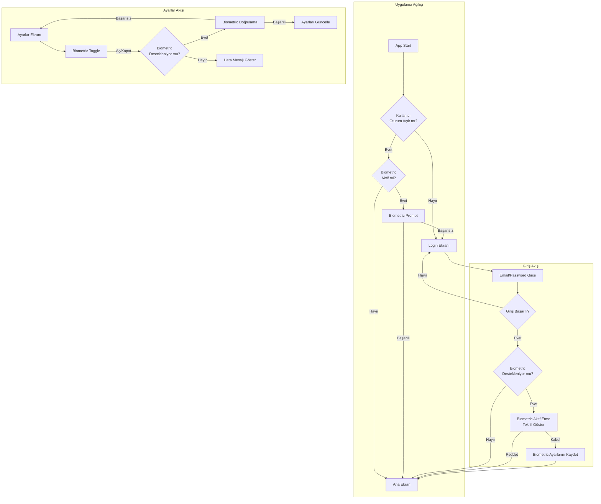
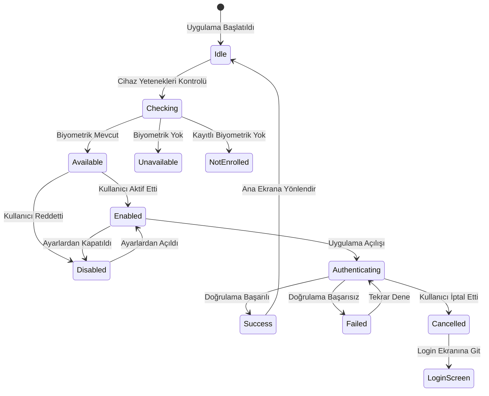

# Biyometrik Kimlik Doğrulama (FaceID/TouchID) Entegrasyon Planı

## Genel Bakış

Bu plan, CineSearch uygulamasına FaceID/TouchID biyometrik kimlik doğrulama özelliğinin entegrasyonunu detaylandırmaktadır.

## Kullanılan Teknoloji

- [`expo-local-authentication`](package.json:46) - Expo'nun biyometrik kimlik doğrulama API'si
- [`expo-secure-store`](package.json:49) - Güvenli token saklama
- Zustand - State yönetimi
- React Native - UI

## Mimari Diyagram



## Biyometrik Doğrulama Durum Makinesi



## Dosya Yapısı

```
app/
├── _layout.tsx                    # Biyometrik kontrol entegrasyonu
├── (auth)/
│   └── login.tsx                  # Biyometrik giriş butonu
├── (tabs)/
│   └── settings.tsx               # Biyometrik toggle
hooks/
├── useBiometricAuth.ts            # Yeni: Biyometrik hook
store/
├── authStore.ts                   # Biyometrik state güncellemesi
i18n/locales/
├── tr.json                        # TR çeviriler
└── en.json                        # EN çeviriler
```

## Veri Modeli

### AuthState Güncellemesi

```typescript
interface AuthState {
  // Mevcut alanlar...
  
  // Yeni biyometrik alanlar
  isBiometricEnabled: boolean;
  biometricType: 'faceID' | 'touchID' | 'fingerprint' | 'iris' | 'none';
  lastAuthenticatedAt: number | null;
  
  // Yeni actions
  enableBiometric: () => Promise<void>;
  disableBiometric: () => Promise<void>;
  authenticateWithBiometric: () => Promise<boolean>;
  checkBiometricSupport: () => Promise<BiometricSupport>;
}

interface BiometricSupport {
  isAvailable: boolean;
  isEnrolled: boolean;
  biometricType: string;
  error?: string;
}
```

## Akış Detayları

### 1. Uygulama Açılış Akışı

1. [`app/_layout.tsx`](app/_layout.tsx:1) içinde auth kontrolü yapılır
2. Kullanıcı oturum açık ve biyometrik aktif ise:
   - [`useBiometricAuth`](hooks/useBiometricAuth.ts) hook'u çağrılır
   - Biyometrik prompt gösterilir
   - Başarılı → Ana ekran
   - Başarısız/İptal → Login ekranı

### 2. Login Akışı

1. Kullanıcı email/şifre ile giriş yapar
2. Giriş başarılı ise:
   - Cihaz biyometrik destekliyor mu kontrol edilir
   - Destekliyorsa kullanıcıya aktif etme teklifi gösterilir
   - Kabul ederse [`enableBiometric`](store/authStore.ts) çağrılır

### 3. Ayarlar Akışı

1. [`app/(tabs)/settings.tsx`](app/(tabs)/settings.tsx:1) içinde toggle gösterilir
2. Toggle açıldığında:
   - Biyometrik doğrulama yapılır
   - Başarılı ise ayar kaydedilir
   - Başarısız ise toggle eski haline döner

## Güvenlik Önlemleri

1. **Token Saklama**: [`expo-secure-store`](package.json:49) kullanılarak güvenli saklama
2. **Timeout**: 5 dakikalık oturum timeout'u
3. **Fallback**: Biyometrik başarısız olursa şifre girişi
4. **İptal**: Kullanıcı istediği zaman ayarlardan kapatabilir

## Hata Senaryoları

| Senaryo | Kullanıcı Deneyimi |
|---------|-------------------|
| Cihaz biyometrik desteklemiyor | Toggle gizli/gri, bilgi mesajı |
| Kayıtlı biyometrik yok | Ayarlar'a yönlendirme prompt'u |
| Biyometrik başarısız (3 deneme) | Şifre girişine zorla |
| Kullanıcı iptal etti | Login ekranına dön |
| Hardware hatası | Hata mesajı, şifre girişi |

## i18n Çevirileri

### TR
```json
{
  "biometric": {
    "enable": "Face ID / Touch ID Aktif Et",
    "disable": "Face ID / Touch ID Kapat",
    "promptTitle": "Kimlik Doğrulama",
    "promptSubtitle": "Devam etmek için biyometrik kimlik doğrulama kullanın",
    "cancel": "İptal",
    "notAvailable": "Bu cihaz biyometrik kimlik doğrulamayı desteklemiyor",
    "notEnrolled": "Kayıtlı biyometrik veri bulunamadı. Ayarlar'dan ekleyin.",
    "enablePrompt": "Girişleri hızlandırmak için Face ID / Touch ID kullanmak ister misiniz?",
    "authenticationFailed": "Kimlik doğrulama başarısız oldu",
    "tooManyAttempts": "Çok fazla başarısız deneme. Lütfen şifrenizi girin."
  }
}
```

### EN
```json
{
  "biometric": {
    "enable": "Enable Face ID / Touch ID",
    "disable": "Disable Face ID / Touch ID",
    "promptTitle": "Authentication",
    "promptSubtitle": "Use biometric authentication to continue",
    "cancel": "Cancel",
    "notAvailable": "This device does not support biometric authentication",
    "notEnrolled": "No biometric data found. Please add it in Settings.",
    "enablePrompt": "Would you like to use Face ID / Touch ID to speed up logins?",
    "authenticationFailed": "Authentication failed",
    "tooManyAttempts": "Too many failed attempts. Please enter your password."
  }
}
```

## Test Senaryoları

1. **Unit Tests**:
   - Biyometrik destek kontrolü
   - Doğrulama başarılı/başarısız senaryoları
   - State yönetimi

2. **Integration Tests**:
   - Login → Biyometrik aktif etme akışı
   - Ayarlardan açma/kapama
   - Uygulama açılışında doğrulama

3. **E2E Tests**:
   - Tam kullanıcı akışı
   - Hata senaryoları
   - Farklı cihaz tipleri

## İmplementasyon Adımları

1. [ ] [`useBiometricAuth.ts`](hooks/useBiometricAuth.ts) hook'unu oluştur
2. [ ] [`authStore.ts`](store/authStore.ts) güncelle
3. [ ] [`login.tsx`](app/(auth)/login.tsx) biyometrik buton ekle
4. [ ] [`settings.tsx`](app/(tabs)/settings.tsx) toggle ekle
5. [ ] [`_layout.tsx`](app/_layout.tsx) açılış kontrolü ekle
6. [ ] i18n çevirilerini güncelle
7. [ ] Unit testleri yaz
