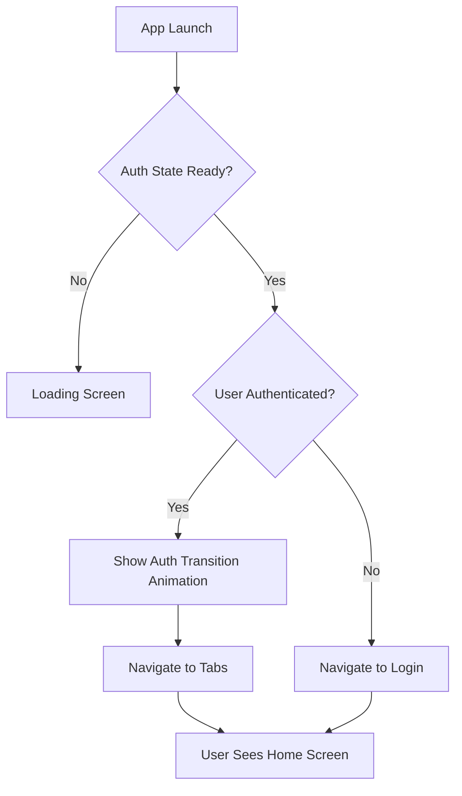

# CineSearch - Expert-Level Analysis & Product Roadmap

## Executive Summary

This document provides a comprehensive expert analysis of the CineSearch project, identifying gaps, improvement opportunities, and a feature roadmap from both a developer and product owner perspective.

---

## 1. Current State Analysis

### 1.1 Project Strengths ✅

| Area | Status | Details |
|------|--------|---------|
| **Architecture** | ✅ Strong | Feature-based folder structure, clean separation of concerns |
| **Authentication** | ✅ Complete | Biometric auth, secure storage, social auth providers |
| **Security** | ✅ Production-ready | SSL pinning, root/jailbreak detection, encrypted storage |
| **Observability** | ✅ Excellent | OpenTelemetry + Sentry integration, performance monitoring |
| **Internationalization** | ✅ Ready | i18next with EN/TR support |
| **UI/UX** | ✅ Modern | Glassmorphism, animations, responsive design |
| **State Management** | ✅ Scalable | Zustand + React Query pattern |

### 1.2 Technical Debt & Gaps 🔧

| Priority | Issue | Impact |
|----------|-------|--------|
| **High** | Auth flow doesn't skip login for authenticated users | UX friction |
| **High** | Mock data in production hooks | App doesn't show real movies |
| **Medium** | No real backend integration | Limited functionality |
| **Medium** | Missing push notifications | User engagement gap |
| **Medium** | No user profiles | Personalization limited |
| **Low** | Incomplete testing coverage | Quality risk |
| **Low** | No analytics dashboard | Product decisions limited |

---

## 2. Authentication Flow Optimization

### 2.1 Current Issue

Currently, the app doesn't automatically redirect authenticated users to the main app. Users see the login screen even when they have valid credentials stored.

### 2.2 Solution Architecture



### 2.3 Implementation Steps

1. **Create splash screen** with auth check initialization
2. **Modify root layout** to handle initial auth state
3. **Add transition guard** for authenticated users
4. **Implement persistent session** with token refresh

### 2.4 Code Changes Required

**File: `app/_layout.tsx`**
```tsx
// Add splash screen and auth guard
function RootLayoutNav() {
    const { isAuthenticated, isLoading } = useAuthStore();
    
    if (isLoading) {
        return <SplashScreen />;
    }
    
    return (
        <>
            <AuthTransition isVisible={isAuthenticated} />
            <Navigator isAuthenticated={isAuthenticated} />
        </>
    );
}
```

**File: `app/index.tsx`**
```tsx
// Redirect based on auth state
export default function Index() {
    const { isAuthenticated } = useAuthStore();
    
    useEffect(() => {
        router.replace(isAuthenticated ? '/(tabs)' : '/(auth)/login');
    }, [isAuthenticated]);
    
    return null;
}
```

---

## 3. Missing Features & Improvements

### 3.1 Core Features (Must Have)

| Feature | Description | Priority |
|---------|-------------|----------|
| **Real Movie Data** | Integrate TMDB API properly | P0 |
| **User Profiles** | Avatar, bio, settings per user | P0 |
| **Watchlist** | Save movies to watch later | P0 |
| **Movie Reviews** | User ratings and reviews | P0 |
| **Social Sharing** | Share movies to social media | P0 |
| **Push Notifications** | New releases, favorites updates | P1 |

### 3.2 Enhanced Features (Should Have)

| Feature | Description | Priority |
|---------|-------------|----------|
| **Search Filters** | Genre, year, rating filters | P1 |
| **Movie Recommendations** | AI-based suggestions | P1 |
| **Offline Mode** | Download for offline viewing | P1 |
| **Watch History** | Track watched movies | P2 |
| **Dark/Light Theme** | System theme detection | P2 |
| **Accessibility** | VoiceOver, screen reader support | P2 |

### 3.3 Delight Features (Nice to Have)

| Feature | Description | Priority |
|---------|-------------|----------|
| **AR Movie Posters** | View posters in AR | P3 |
| **Widget Support** | Home screen widgets | P3 |
| **Watch Party** | Sync watch with friends | P3 |
| **Gamification** | Badges, achievements | P3 |
| **Podcasts** | Movie discussion podcasts | P3 |

---

## 4. Technical Improvements

### 4.1 Backend Integration

```
Backend Requirements:
├── Authentication
│   ├── JWT token management
│   ├── OAuth 2.0 providers
│   └── Biometric token storage
├── User Service
│   ├── User CRUD operations
│   ├── Profile management
│   └── Social connections
├── Movie Service
│   ├── TMDB sync
│   ├── Cache management
│   └── Recommendation engine
└── Favorites Service
    ├── Cross-device sync
    ├── Watchlist management
    └── Share functionality
```

### 4.2 Database Schema (Suggested)

```sql
-- Users table
CREATE TABLE users (
    id UUID PRIMARY KEY,
    email VARCHAR(255) UNIQUE,
    name VARCHAR(100),
    avatar_url VARCHAR(500),
    bio TEXT,
    created_at TIMESTAMP,
    updated_at TIMESTAMP
);

-- Favorites table
CREATE TABLE favorites (
    id UUID PRIMARY KEY,
    user_id UUID REFERENCES users(id),
    movie_id INTEGER,
    created_at TIMESTAMP
);

-- Watchlist table
CREATE TABLE watchlist (
    id UUID PRIMARY KEY,
    user_id UUID REFERENCES users(id),
    movie_id INTEGER,
    notify_on_release BOOLEAN,
    created_at TIMESTAMP
);

-- Reviews table
CREATE TABLE reviews (
    id UUID PRIMARY KEY,
    user_id UUID REFERENCES users(id),
    movie_id INTEGER,
    rating DECIMAL(2,1),
    review_text TEXT,
    spoiler BOOLEAN,
    created_at TIMESTAMP
);
```

### 4.3 API Endpoints

| Method | Endpoint | Description |
|--------|----------|-------------|
| POST | `/api/auth/login` | User login |
| POST | `/api/auth/register` | User registration |
| GET | `/api/user/profile` | Get user profile |
| PUT | `/api/user/profile` | Update profile |
| GET | `/api/movies/popular` | Get popular movies |
| GET | `/api/movies/:id` | Get movie details |
| GET | `/api/favorites` | Get user favorites |
| POST | `/api/favorites` | Add to favorites |
| DELETE | `/api/favorites/:id` | Remove from favorites |
| GET | `/api/watchlist` | Get watchlist |
| POST | `/api/watchlist` | Add to watchlist |

---

## 5. Feature Roadmap

### Phase 1: Foundation (Weeks 1-2)

| Task | Description | Effort |
|------|-------------|--------|
| Fix auth flow | Skip login for authenticated users | 2 days |
| Real TMDB integration | Replace mock data with API calls | 3 days |
| Splash screen | Native splash with auth check | 1 day |
| Error handling | Improve error boundaries | 2 days |

### Phase 2: Core Features (Weeks 3-4)

| Task | Description | Effort |
|------|-------------|--------|
| User profiles | Profile screen and editing | 3 days |
| Watchlist | Save movies to watch later | 2 days |
| Movie reviews | Ratings and reviews | 3 days |
| Search filters | Advanced search options | 2 days |

### Phase 3: Social & Sync (Weeks 5-6)

| Task | Description | Effort |
|------|-------------|--------|
| Cloud sync | Cross-device favorites sync | 3 days |
| Social sharing | Share to social media | 2 days |
| Push notifications | New release alerts | 2 days |
| Friend system | Follow users | 3 days |

### Phase 4: Polish (Weeks 7-8)

| Task | Description | Effort |
|------|-------------|--------|
| Performance | Optimize animations, caching | 2 days |
| Accessibility | WCAG compliance | 2 days |
| Analytics | User behavior tracking | 2 days |
| Testing | E2E test coverage | 3 days |

---

## 6. Product Owner Perspective

### 6.1 User Personas

| Persona | Goals | Pain Points |
|---------|-------|------------|
| **Movie Enthusiast** | Discover new movies, track watched | Too many choices, no recommendations |
| **Casual Viewer** | Find something to watch tonight | Decision paralysis |
| **Social Sharer** | Share opinions, follow friends | No easy way to share |
| **Power User** | Track collection, rate movies | Data not synced across devices |

### 6.2 Success Metrics

| Metric | Target | Measurement |
|--------|--------|-------------|
| DAU/MAU Ratio | > 30% | Analytics |
| Session Duration | > 5 min | Analytics |
| Feature Adoption | > 50% use favorites | Analytics |
| Retention Rate | > 40% day 7 | Analytics |
| Crash-Free Users | > 99% | Sentry |
| App Store Rating | > 4.5 stars | Reviews |

### 6.3 Monetization Strategy (Future)

| Strategy | Description | Timeline |
|----------|-------------|----------|
| Freemium | Basic free, premium features | Phase 5 |
| Ads | Banner ads, rewarded videos | Phase 5 |
| Affiliate | Movie rental/surchase | Phase 6 |
| Premium Subscription | Ad-free, exclusive features | Phase 6 |

---

## 7. Implementation Priority Matrix

```
                    High Impact
                        │
    ┌───────────────────┼───────────────────┐
    │                   │                   │
    │  REAL DATA        │  USER PROFILES    │
    │  AUTH FLOW        │  WATCHLIST        │
    │                   │                   │
Low │──────────────────┼──────────────────│ High
Effort│                   │                   │ Effort
    │                   │                   │
    │  PUSH NOTIFS      │  RECOMMENDATIONS  │
    │  SOCIAL SHARE     │  OFFLINE MODE     │
    │                   │                   │
    └───────────────────┼───────────────────┘
                        │
                    Low Impact
```

---

## 8. Quick Wins (1-2 Days)

1. ✅ **Fix auth flow** - Redirect authenticated users immediately
2. ✅ **Add splash screen** - Professional launch experience
3. ✅ **Real TMDB API** - Replace mock data with live API
4. ✅ **Error toasts** - Better error feedback
5. ✅ **Loading skeletons** - Improved perceived performance

---

## 9. Conclusion

CineSearch has a solid foundation with production-ready architecture. The main priorities are:

1. **Fix authentication flow** - Immediate UX improvement
2. **Integrate real movie data** - Core functionality
3. **Add user profiles** - Personalization
4. **Build watchlist** - Engagement feature
5. **Implement cloud sync** - Cross-device experience

This roadmap provides a clear path from MVP to a fully-featured movie discovery platform.
