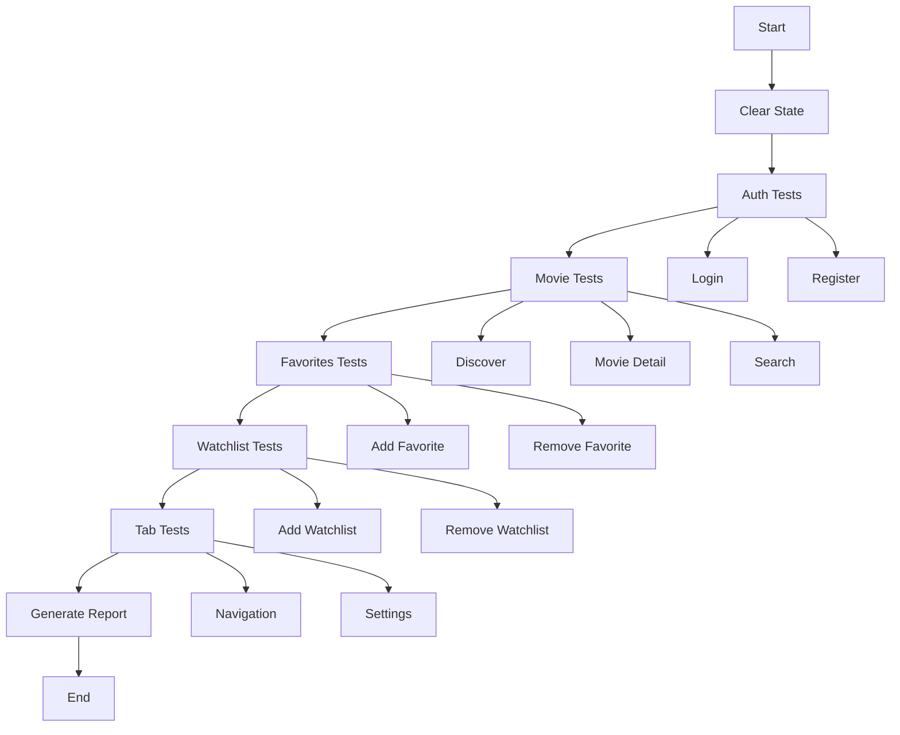

# Maestro Test Stabilization Plan

## Executive Summary

This plan outlines the steps to run all existing Maestro tests and make them stable. The goal is to ensure all 13 test flows pass consistently without flakiness.

---

## Current Test Inventory

### Test Flows (13 total)

| Category      | Flow File                               | Status          | Issues Identified               |
| ------------- | --------------------------------------- | --------------- | ------------------------------- |
| **Setup**     | `flows/setup/clear-state.yaml`          | ⚠️ Needs review | Basic state clearing            |
| **Setup**     | `flows/setup/auth-flow.yaml`            | ⚠️ Needs review | Incomplete auth flow            |
| **Auth**      | `flows/auth/login.yaml`                 | ⚠️ Unstable     | Hardcoded credentials, no retry |
| **Auth**      | `flows/auth/register.yaml`              | ⚠️ Unstable     | Long flow, no cleanup           |
| **Movies**    | `flows/movies/discover.yaml`            | ⚠️ Unstable     | Network flakiness               |
| **Movies**    | `flows/movies/movie-detail.yaml`        | ⚠️ Unstable     | Video player wait issues        |
| **Movies**    | `flows/movies/search.yaml`              | ⚠️ Unstable     | Search result timing            |
| **Favorites** | `flows/favorites/add-favorite.yaml`     | ⚠️ Unstable     | No state cleanup                |
| **Favorites** | `flows/favorites/remove-favorite.yaml`  | ⚠️ Unstable     | Empty state handling            |
| **Watchlist** | `flows/watchlist/add-watchlist.yaml`    | ⚠️ Unstable     | No state cleanup                |
| **Watchlist** | `flows/watchlist/remove-watchlist.yaml` | ⚠️ Unstable     | Empty state handling            |
| **Tabs**      | `flows/tabs/navigation.yaml`            | ⚠️ Unstable     | Basic navigation                |
| **Tabs**      | `flows/tabs/settings.yaml`              | ⚠️ Unstable     | Logout flow issues              |

---

## Issues Identified

### 1. Environment Variable Inconsistency

**Problem:** Some flows use hardcoded values while others use `${APP_ID}` or `${TEST_EMAIL}`.

**Examples:**

- `login.yaml`: Uses hardcoded `test@test.com` and `123456`
- `register.yaml`: Uses `${TEST_EMAIL}`, `${TEST_PASSWORD}`, `${TEST_NAME}`
- `discover.yaml`: Uses hardcoded `test@test.com` and `123456`

**Solution:** Standardize all flows to use environment variables from `.env.test`.

### 2. Network Flakiness

**Problem:** API calls to TMDB can be slow or fail, causing tests to timeout.

**Examples:**

- `discover.yaml`: Movie cards may not load within timeout
- `search.yaml`: Search results may take time to appear
- `movie-detail.yaml`: Video player may not load

**Solution:** Add retry mechanisms with `repeat` and `extendedWaitUntil`.

### 3. State Management Issues

**Problem:** Tests don't properly clean up state between runs, causing interference.

**Examples:**

- `add-favorite.yaml` and `remove-favorite.yaml` may conflict
- `add-watchlist.yaml` and `remove-watchlist.yaml` may conflict
- `register.yaml` doesn't clean up after registration

**Solution:** Add `clearState` at the beginning of each test and proper logout at the end.

### 4. Text-Based Assertions

**Problem:** Some flows use text assertions that may fail with different languages.

**Examples:**

- `login.yaml`: `assertVisible: "Login"`
- `register.yaml`: `assertVisible: "Create Account"`
- `settings.yaml`: `assertVisible: "Logout"`

**Solution:** Use `testID` instead of text where possible.

### 5. Timeout Inconsistency

**Problem:** Different flows use different timeout values.

**Examples:**

- `login.yaml`: 30000ms for animation, 15000ms for extended wait
- `discover.yaml`: 15000ms for extended wait
- `search.yaml`: 10000ms for repeat timeout

**Solution:** Standardize timeout values based on operation type.

---

## Stabilization Strategy

### Phase 1: Configuration Standardization

1. **Update `.env.test`** - Ensure all required variables are defined
2. **Update `config.yaml`** - Add standardized timeout values
3. **Update `maestro-ci.yaml`** - Ensure CI configuration matches local config

### Phase 2: Flow Improvements

#### 2.1 Setup Flows

**`flows/setup/clear-state.yaml`**

- Add proper state clearing
- Verify app is in clean state

**`flows/setup/auth-flow.yaml`**

- Complete the auth flow
- Add proper error handling
- Save auth state for reuse

#### 2.2 Auth Flows

**`flows/auth/login.yaml`**

- Replace hardcoded credentials with `${TEST_EMAIL}` and `${TEST_PASSWORD}`
- Add retry mechanism for network issues
- Add proper error assertions

**`flows/auth/register.yaml`**

- Add cleanup at the end (logout)
- Add retry for network issues
- Optimize flow length

#### 2.3 Movie Flows

**`flows/movies/discover.yaml`**

- Add retry mechanism for movie card loading
- Add pull-to-refresh retry
- Use `runFlow` to call setup

**`flows/movies/movie-detail.yaml`**

- Add retry for video player loading
- Make video player check optional (may not always load)
- Add proper back navigation

**`flows/movies/search.yaml`**

- Add retry for search results
- Optimize repeat loops
- Add proper cleanup

#### 2.4 Favorites Flows

**`flows/favorites/add-favorite.yaml`**

- Add `clearState` at the beginning
- Add logout at the end
- Use `runFlow` for auth

**`flows/favorites/remove-favorite.yaml`**

- Add `clearState` at the beginning
- Add logout at the end
- Handle empty state properly

#### 2.5 Watchlist Flows

**`flows/watchlist/add-watchlist.yaml`**

- Add `clearState` at the beginning
- Add logout at the end
- Use `runFlow` for auth

**`flows/watchlist/remove-watchlist.yaml`**

- Add `clearState` at the beginning
- Add logout at the end
- Handle empty state properly

#### 2.6 Tab Flows

**`flows/tabs/navigation.yaml`**

- Add `clearState` at the beginning
- Use `runFlow` for auth
- Add logout at the end

**`flows/tabs/settings.yaml`**

- Add `clearState` at the beginning
- Use `runFlow` for auth
- Add proper logout flow

### Phase 3: Master Test Runner

Create a master test runner script that:

1. Runs all tests in the correct order
2. Provides clear output for each test
3. Generates a summary report
4. Takes screenshots on failure
5. Cleans up between test suites

### Phase 4: Documentation

1. Update `README.md` with test execution instructions
2. Document common issues and solutions
3. Create troubleshooting guide

---

## Test Execution Order



---

## Standardized Timeout Values

| Operation Type     | Timeout | Notes              |
| ------------------ | ------- | ------------------ |
| Animation End      | 30000ms | Initial app load   |
| Network Request    | 15000ms | API calls          |
| Element Visibility | 10000ms | Standard wait      |
| Repeat Loop        | 5000ms  | Per iteration      |
| Extended Wait      | 15000ms | Complex operations |
| Screenshot         | 2000ms  | Capture time       |

---

## Retry Strategy

### Network Operations

```yaml
- repeat:
    times: 3
    timeout: 10000
    commands:
      - scroll
      - waitForAnimationToEnd
    whileElementNotVisible: "movie-card-0"
```

### Extended Wait with Fallback

```yaml
- extendedWaitUntil:
    timeout: 15000
    visible:
      - "movies-flatlist"
      - "movie-card-0"
    then:
      - assertVisible: "Popular"
```

---

## Success Criteria

A test is considered stable when:

1. ✅ Passes 5 consecutive runs without modification
2. ✅ No flakiness due to network issues
3. ✅ No state interference between tests
4. ✅ Proper cleanup after each test
5. ✅ Clear error messages on failure

---

## Implementation Steps

1. **Standardize Environment Variables**
   - Update all flows to use `${APP_ID}`, `${TEST_EMAIL}`, `${TEST_PASSWORD}`, `${TEST_NAME}`
   - Ensure `.env.test` is properly configured

2. **Add State Management**
   - Add `clearState` at the beginning of each test
   - Add logout at the end of authenticated tests
   - Use `runFlow` to call setup flows

3. **Add Retry Mechanisms**
   - Add `repeat` loops for network operations
   - Add `extendedWaitUntil` for complex operations
   - Add fallback assertions

4. **Improve Error Handling**
   - Add proper assertions for error states
   - Add screenshots on failure
   - Add clear error messages

5. **Create Master Test Runner**
   - Create script to run all tests
   - Generate summary report
   - Handle failures gracefully

6. **Run and Verify**
   - Run all tests 5 times
   - Document any remaining issues
   - Fix any flakiness found

---

## Expected Outcomes

After stabilization:

- All 13 test flows pass consistently
- Test execution time is optimized
- Clear documentation for running tests
- Automated test runner with reporting
- Screenshots on failure for debugging
