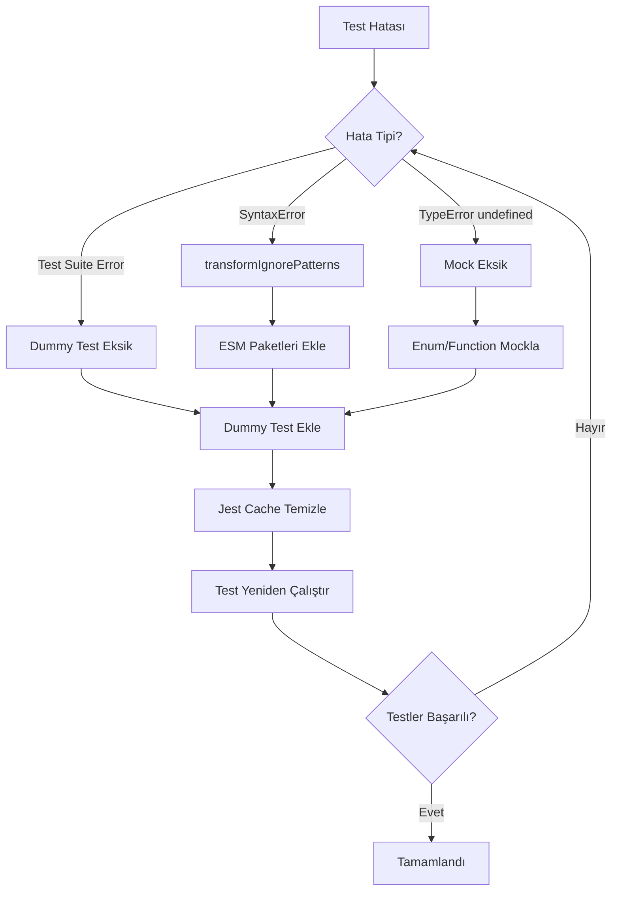

# Test Konfigürasyonu İyileştirme Planı

## Tespit Edilen Sorunlar

### 1. ESM/CommonJS Çakışmaları (SyntaxError: Unexpected token 'export')
- **Dosya**: [jest.config.js](../jest.config.js:34)
- **Sebep**: `transformIgnorePatterns` `@sentry/react-native` ve `react-native-worklets` paketlerini içermiyor
- **Çözüm**: Bu paketleri transform listesine ekle

### 2. Expo Haptics Mock Eksikliği (TypeError: Cannot read properties of undefined reading 'Light')
- **Dosya**: [tests/setup.ts](../tests/setup.ts:78)
- **Sebep**: `ImpactFeedbackStyle` ve `NotificationFeedbackType` enum'ları tanımlanmamış
- **Çözüm**: Mock'a eksik enum değerlerini ekle

### 3. React Native Worklets Mock Eksikliği
- **Sebep**: `react-native-worklets` paketi için mock yok
- **Çözüm**: Worklets mock ekle

### 4. Sentry Mock Eksikliği
- **Sebep**: `@sentry/react-native` için yeterli mock yok
- **Çözüm**: Sentry mock ekle/güçlendir

---

## Uygulanacak Değişiklikler

### A. [jest.config.js](../jest.config.js) Güncelleme

```javascript
// Mevcut transformIgnorePatterns:
transformIgnorePatterns: [
  "node_modules/(?!(react-native|@react-native|expo|expo-constants|expo-file-system|expo-secure-store|expo-modules-core|@expo|react-native-reanimated|react-native-gesture-handler|react-native-screens|react-native-safe-area-context|@react-navigation|react-native-web|lottie-react-native|@hookform|react-hook-form|@tanstack)/)",
],

// Yeni transformIgnorePatterns (eklenecekler: @sentry/react-native, react-native-worklets, sentry-expo):
transformIgnorePatterns: [
  "node_modules/(?!(react-native|@react-native|expo|expo-constants|expo-file-system|expo-secure-store|expo-modules-core|@expo|react-native-reanimated|react-native-gesture-handler|react-native-screens|react-native-safe-area-context|@react-navigation|react-native-web|lottie-react-native|@hookform|react-hook-form|@tanstack|@sentry/react-native|react-native-worklets|sentry-expo)/)",
],
```

### B. [tests/setup.ts](../tests/setup.ts) Güncelleme

**1. Expo Haptics Mock (satır 78-82):**
```typescript
jest.mock("expo-haptics", () => ({
  impactAsync: jest.fn(),
  notificationAsync: jest.fn(),
  selectionAsync: jest.fn(),
  ImpactFeedbackStyle: {
    Light: 'light',
    Medium: 'medium',
    Heavy: 'heavy',
  },
  NotificationFeedbackType: {
    Success: 'success',
    Warning: 'warning',
    Error: 'error',
  },
}));
```

**2. Yeni Eklenecek Mocklar:**
- `@sentry/react-native` mock
- `react-native-worklets` mock
- `sentry-expo` mock

---

## Test Edilecek Paketler

| Paket | Sorun Tipi | Çözüm |
|-------|------------|-------|
| `@sentry/react-native` | ESM export | transformIgnorePatterns |
| `react-native-worklets` | ESM export | transformIgnorePatterns + mock |
| `expo-haptics` | Enum eksik | Mock'a enum ekle |
| `sentry-expo` | ESM export | transformIgnorePatterns + mock |

---

## Akış Diyagramı



---

## Sonraki Adımlar

1. Planı onayla
2. Code mode'a geç
3. Değişiklikleri uygula
4. Testleri çalıştır ve doğrula
